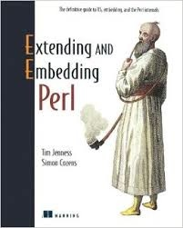

# Refereed Academic Publications

**Selected highlights**

* [Reimplementing the Hierarchical Data System using HDF5](http://dx.doi.org/10.1016/j.ascom.2015.02.003)
  _Jenness, T._
  Astronomy &amp;Computing, 2015, in press (special issue on data formats)

* [Observatory/data centre partnerships and the VO-centric archive: The JCMT Science Archive experience](http://dx.doi.org/10.1016/j.ascom.2014.12.005)
  _Economou, F.; Gaudet, S.; Jenness, T. &amp; 10 co-authors_
  Astronomy &amp; Computing, 2015, in press (special issue on the Virtual Observatory: II)

* [Learning from 25 years of the extensible _N_-Dimensional Data Format](http://dx.doi.org/10.1016/j.ascom.2014.11.001)
  _Jenness, T.; Berry, D.S.; Currie, M.J. &amp; 8 co-authors_
  Astronomy &amp; Computing, 2015, in press (special issue on data formats)

* [ORAC-DR: A generic data reduction pipeline infrastructure](http://adsabs.harvard.edu/abs/2015A%26C.....9...40J)
  _Jenness, T.; Economou, F._
  Astronomy &amp; Computing, 2015, 9, 40

* [Astropy: A community Python package for astronomy](http://adsabs.harvard.edu/abs/2013A%26A...558A..33A)
  _Astropy Collaboration &amp; 44 co-authors_
  A&amp;A, 2013, 558, 33

* [SCUBA-2: iterative map-making with the Sub-Millimetre User Reduction Facility](http://adsabs.harvard.edu/abs/2013MNRAS.430.2545C)
  _Chapin, Edward L.; Berry, David S.; Gibb, Andrew G.; Jenness, Tim; Scott, Douglas; Tilanus, Remo P. J.; Economou, Frossie &amp; Holland, Wayne S._
  MNRAS, 2013, 430, 2545

* [SCUBA-2: on-sky calibration using submillimetre standard sources](http://adsabs.harvard.edu/abs/2013MNRAS.430.2534D)
  _Dempsey, J. T.; Friberg, P.; Jenness, T. &amp; 11 co-authors_
  MNRAS, 2013, 430, 2534

* [Observations of flat-spectrum radio sources at &lambda;850&mu;m from the James Clerk Maxwell Telescope II. April 2000 to June 2005](http://adsabs.harvard.edu/abs/2010MNRAS.401.1240J)
  _Jenness, T.; Robson, E. I. &amp; Stevens, J. A._
  MNRAS, 2010, 401, 1240

* [The SCUBA Half-Degree Extragalactic Survey - I. Survey motivation, design and data processing](http://adsabs.harvard.edu/abs/2005MNRAS.363..563M)
  _Mortier, A. M. J.; Serjeant, S.; Dunlop, J. S. &amp; 75 co-authors_
  MNRAS, 2005, 363, 563

* [Towards the automated reduction and calibration of SCUBA data from the James Clerk Maxwell Telescope](http://adsabs.harvard.edu/abs/2002MNRAS.336...14J)
  _Jenness, T.; Stevens, J. A.; Archibald, E. N.; Economou, F.; Jessop, N. E. &amp; Robson, E. I._
  MNRAS, 2002, 336, 14

* [Observations of flat-spectrum radio sources at &lambda;850 &mu;m from the James Clerk Maxwell Telescope - I. 1997 April to 2000 April](http://adsabs.harvard.edu/abs/2001MNRAS.327..751R)
  _Robson, E. I.; Stevens, J. A. &amp; Jenness, T._
  MNRAS, 2001, 327, 751

* [Magnetic field surrounding the starburst nucleus of the galaxy M82 from polarized dust emission](http://adsabs.harvard.edu/abs/2000Natur.404..732G)
  _Greaves, J. S.; Holland, W. S.; Jenness, T. &amp; Hawarden, T. G._
  Nature, 2000, 404, 732

* [A Deep Submillimeter Survey of the Galactic Center](http://adsabs.harvard.edu/abs/2000ApJ...545L.121P)
  _Pierce-Price, D.; Richer, J.S.; Greaves, J.S. &amp; 13 co-authors_
  ApJ, 2000, 545, 121

* [A Dust Ring around &epsilon; Eridani: Analog to the Young Solar System](http://adsabs.harvard.edu/abs/1998ApJ...506L.133G)
  _Greaves, J. S.; Holland, W.S.; Moriarty-Schieven, G. &amp; 8 co-authors_
  ApJ, 1998, 506, 133

* [High-redshift star formation in the Hubble Deep Field revealed by a submillimetre-wavelength survey](http://adsabs.harvard.edu/abs/1998Natur.394..241H)
  _Hughes, David H.; Serjeant, S.; Dunlop, J.S. &amp; 12 co-authors_
  Nature, 1998, 394, 241

* [Studies of Embedded Far Infrared Sources in the Vicinity of H2O Masers - I. Observations](http://adsabs.harvard.edu/abs/1995MNRAS.276.1024J)
  _Jenness, T.; Scott, P. F. &amp; Padman, R._
  MNRAS, 1995, 276, 1024

See also: [Full list](refereed)

A complete list of publications is also available on [ADS](http://adsabs.harvard.edu/cgi-bin/nph-abs_connect?db_key=AST&db_key=PRE&qform=AST&arxiv_sel=astro-ph&arxiv_sel=cond-mat&arxiv_sel=cs&arxiv_sel=gr-qc&arxiv_sel=hep-ex&arxiv_sel=hep-lat&arxiv_sel=hep-ph&arxiv_sel=hep-th&arxiv_sel=math&arxiv_sel=math-ph&arxiv_sel=nlin&arxiv_sel=nucl-ex&arxiv_sel=nucl-th&arxiv_sel=physics&arxiv_sel=quant-ph&arxiv_sel=q-bio&sim_query=YES&ned_query=YES&aut_req=YES&aut_logic=OR&obj_logic=OR&author=Jenness%2C+T.&object=&start_mon=&start_year=&end_mon=&end_year=&ttl_logic=OR&title=&txt_logic=OR&text=&nr_to_return=300&start_nr=1&jou_pick=ALL&ref_stems=&data_and=ALL&group_and=ALL&start_entry_day=&start_entry_mon=&start_entry_year=&end_entry_day=&end_entry_mon=&end_entry_year=&min_score=&sort=SCORE&data_type=SHORT&aut_syn=YES&ttl_syn=YES&txt_syn=YES&aut_wt=1.0&obj_wt=1.0&ttl_wt=0.3&txt_wt=3.0&aut_wgt=YES&obj_wgt=YES&ttl_wgt=YES&txt_wgt=YES&ttl_sco=YES&txt_sco=YES&version=1) and my arXiv page is [jenness_t_1](http://arxiv.org/a/jenness_t_1).

# Non-refereed Academic Publications

**Selected highlights**

* [An overview of the planned CCAT software system](http://adsabs.harvard.edu/abs/2014SPIE.9152E..2WJ)
  _Jenness, T.; Shepherd, M. C.; Schaaf, R. &amp; 7 co-authors_
  Proc. SPIE, 2014, 9152, 91522W

* [Transient alert follow-up planned for CCAT](http://adsabs.harvard.edu/abs/2014htu..conf..199J)
  _Jenness, T._
  Hot-wiring the Transient Universe III, 2014, econf:C131113.1, 199

* [PAL: A Positional Astronomy Library](http://adsabs.harvard.edu/abs/2013ASPC..475..307J)
  _Jenness, T. &amp; Berry, D. S._
  ASP Conf. Ser., 475, 307

* [Data Management at the UKIRT and JCMT](http://adsabs.harvard.edu/abs/2011tfa..confE..42J)
  _Jenness, Tim &amp; Economou, Frossie_
  Telescopes from Afar, 2011, 42 _(invited talk)_

* [New Features in AST: A WCS Management and Manipulation Library](http://adsabs.harvard.edu/abs/2012ASPC..461..825B)
  _Berry, D. S. &amp; Jenness, T._
  ASP Conf. Ser., 461, 825

* [JCMT Science Archive: Advanced Heterodyne Data Products Pipeline](http://adsabs.harvard.edu/abs/2008ASPC..394..565J)
  _Jenness, T.; Cavanagh, B.; Economou, F. &amp; Berry, D. S._
  ASP Conf. Ser., 2008, 394, 565

* [Sharing code and support between heterogeneous telescopes: the UKIRT and JCMT joint software projects](http://adsabs.harvard.edu/abs/2002SPIE.4844..321E)
  _Economou, Frossie; Jenness, Tim &amp; Rees, Nicholas P._
  Proc. SPIE, 2002, 4844, 321

* [Removing sky contributions from SCUBA data](http://adsabs.harvard.edu/abs/1998SPIE.3357..548J)
  _Jenness, Tim; Lightfoot, John F. &amp; Holland, Wayne S._
  Proc. SPIE, 3357, 548

See also: [Full list](conferences)

# Books

[Extending and Embedding Perl](http://www.manning.com/jenness/) by Jenness &amp; Cozens, was published in 2002 by Manning. This book explains how to extend Perl by linking to C (and Fortran) libraries and also how to call the Perl interpreter from a C program.

# PhD Thesis

[A molecular line and continuum study of water maser sources](https://www.repository.cam.ac.uk/handle/1810/245081)
University of Cambridge, 1996

# Software

Github: [github.com/timj](https://github.com/timj) is my primary Github account. This page also lists the organizations to which I contribute.

CPAN: [metacpan.org/author/TJENNESS](https://metacpan.org/author/TJENNESS)

PyPI: [palpy](https://pypi.python.org/pypi/palpy/)

# Technical Documentation

I wrote [ JCMT newsletter articles and other assorted technical document at the JAC](jacdocs) and I have contributed to [25 Starlink documents](stardocs), the following as first author:

* SURF: SCUBA User Reduction Facility
  _Jenness, T.; Lightfoot, J.F._
  Starlink User Note 216, 2003

* NDFPERL: Perl interface to NDF
  _Jenness, T.; Bly, M.J._
  Starlink User Note 222, 1998

* STARPERL: Starlink Perl modules
  _Jenness, T.; Economou, F._
  Starlink User Note 228, 2003

* The Global Section Datafile (GSD) access library
  _Jenness, T.; Tilanus, R.P.J.; Meyerdierks, H.; Fairclough, J._
  Starlink User Note 229, 1999

* ORAC-DR: SCUBA Pipeline Data Reduction
  _Jenness, T.; Economou, F._
  Starlink User Note 231, 2004

* ORAC-DR: Programmer's Guide
  _Jenness, T.; Economou, F., Cavanagh, B._
  Starlink User Note 233, 2004

* SURF Programming interface
  _Jenness, T.; Lightfoot, J.F._
  Starlink System Note 72, 2000
